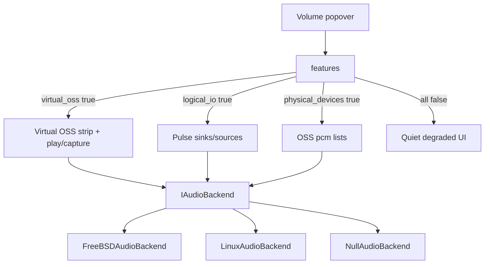
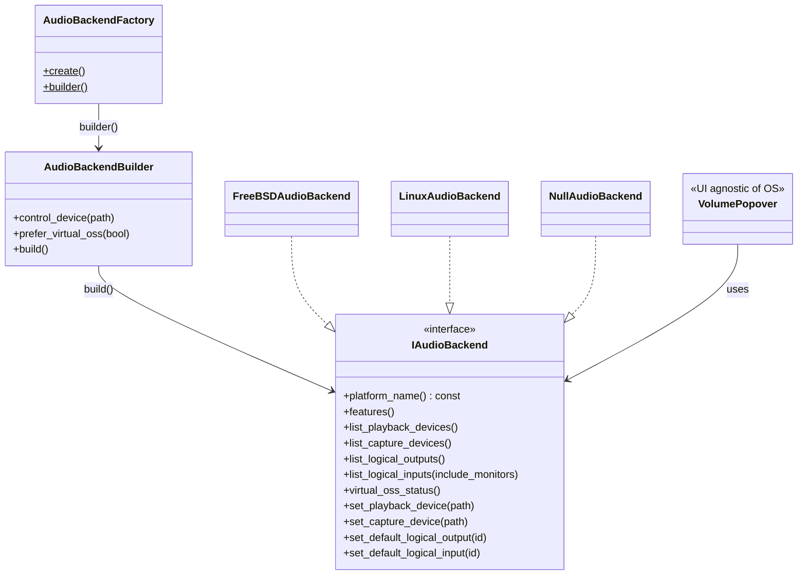

# Audio backend architecture (Factory + Builder)

**Maintainer:** REVYTECH, Inc. · **Repo:** [revytechinc/wf-shell](https://github.com/revytechinc/wf-shell)  

**Orientation:** FreeBSD-centric. **virtual_oss is first-class** when autodetected.  
Pulse/PipeWire and Linux are modular add-ons — never required for the UI to open.

**Status:** Implemented on branch `feature/audio-control-virtual-oss` (see [PLAN.md §15](PLAN.md#15-implementation-addendum-revytech)).

## Coding standards applied (Honcho)

| Rule | Application here |
|------|------------------|
| Factory Method | `AudioBackendFactory::create()` / `AudioBackendBuilder::build()` |
| Builder | Fluent `control_device()`, `prefer_virtual_oss()`, … |
| Abstract interface | `IAudioBackend` — UI never sees FreeBSD/Linux types |
| Platform isolation | Only `audio-backend-builder.cpp` + `*-freebsd.cpp` / `*-linux.cpp` know OS |
| Autodetect | `features()` probes live system; flags default false |
| Fail soft | Missing module → empty list / `available=false` / `OpResult.ok=false` — **never throw** |
| TAOCP | Clear domain types (`AudioDevice`, `AudioStackFeatures`, `VirtualOssStatus`) |

Mirrors existing shell patterns:

- `WFPowerController::create()` + `power-controller-{bsd,linux}.cpp`
- `wayfire::create_platform_backend()` + `platform_backend_t`

## Modular stack (autodetect)



| Module | Flag | FreeBSD (target host) | Linux typical |
|--------|------|------------------------|---------------|
| **Virtual OSS** | `virtual_oss` | **First-class** when `/dev/vdsp.ctl` (or configured ctl) exists | Usually false |
| Physical devices | `physical_devices` | `/dev/sndstat` pcm* | Often same as Pulse list |
| Logical I/O | `logical_io` | `pactl` sinks/sources | Primary path |
| Mix channels | `mix_channels` | When virtual_oss running | Only if VOSS present |
| hw.snd unit | `hw_default_unit` | true | false (no-op ok) |

### UI rules (must not blow up)

1. Call `features()` (or treat every list as optional).
2. If `virtual_oss` → show manage strip + footer badge (first-class).
3. If not → hide VOSS UI entirely; use logical devices when `logical_io`.
4. Empty lists → empty dropdowns, not errors.
5. All `set_*` return `OpResult` — show toast on `!ok`, never crash.

### Autodetection sources

| Probe | FreeBSD | Linux |
|-------|---------|-------|
| `virtual_oss_status()` | `virtual_oss_cmd` + control device | Same if installed; else available=false |
| `list_playback_devices()` | parse `/dev/sndstat` | Pulse sinks |
| `list_logical_outputs()` | `pactl list short sinks` | same |
| Pulse missing | `logical_io=false` | same |
| Unknown OS | `NullAudioBackend` — all empty | |

## Class view



## UI: Virtual OSS first-class when present

| Concern | Where |
|---------|--------|
| Autodetect | `backend->features()` |
| VOSS status | `virtual_oss_status()` → play/capture paths, rate, bits, ch |
| Badge + strip | Only if `features().virtual_oss` |
| Output dropdown | `list_playback_devices()` + `set_playback_device()` |
| Input dropdown | `list_capture_devices()` + `set_capture_device()` |
| Pulse path | `list_logical_*` + `set_default_logical_*` when no VOSS or Advanced |

CLI flags (`-P`/`-R`/`-C`) stay inside FreeBSD backend only.

## Source map

| File | Role |
|------|------|
| `src/util/audio/audio-types.hpp` | Domain model + `AudioStackFeatures` |
| `src/util/audio/audio-backend.hpp` | Interface + Builder + Factory API |
| `src/util/audio/audio-backend-builder.cpp` | Factory Method OS branch |
| `src/util/audio/audio-backend-freebsd.cpp` | FreeBSD product (VOSS first-class) |
| `src/util/audio/audio-backend-linux.cpp` | Linux product (Pulse-primary) |
| `src/util/audio/audio-parse.cpp` | Pure parsers (sndstat, pactl, VOSS) |
| `src/util/audio/audio-process.cpp` | Process/FS helpers + test hooks |
| `src/util/audio/volume-logic.hpp` | Pure volume UI helpers (no GTK) |
| `src/util/audio/audio-backend-cli.cpp` | `wf-audio-info` smoke tool |
| `tests/audio-backend-test.cpp` | gtest unit suite (meson `suite: audio`) |

## Unit tests & coverage

```sh
# All unit suites (power, network, audio)
meson test -C build --suite unit

# Audio only (gtest + python defaults)
meson test -C build --suite audio
docs/audio-control/tests/run_all

# Line coverage of src/util/audio/*.cpp (needs -Db_coverage=true)
docs/audio-control/tests/coverage.sh
```

**Testability design:** pure parsers never touch the OS; backends call `detail::run_capture` /
`path_exists` / `read_text_file`, which unit tests override via `ProcessHooks`. Factory products
for FreeBSD, Linux, and Null are constructible on any host. Residual uncovered lines are
typically `fork` child paths and hard OS failures (pipe/fork fail).

**Not in unit coverage:** `volume.cpp` GTK glue, PeakProbe / Pulse threaded mainloop, Cairo
meter drawing (logic extracted to `volume-logic.hpp` and fully tested).

## CLI smoke test

```sh
wf-audio-info
# prints platform, features (autodetect), virtual_oss status, device lists
```

## Hotplug, headset plug, and auto-switch

### Two different problems

| Question | Meaning on this machine |
|----------|-------------------------|
| **Is a USB DAC present?** | Whole `pcmN` appears/disappears in `/dev/sndstat`. Easy. |
| **Is a headset in the front jack?** | Same Realtek, often **`pcm4` Front Analog** (nid 27+25). Kernel **can** sense the jack; userspace learns via **devd**. |
| **Should Virtual OSS leave HDMI (`pcm1`) for the headset?** | **Our job** (policy). Kernel will not move `virtual_oss -P` by itself. |

On your host today: **speakers/monitor = HDMI pcm1**, **front headset = pcm4**. Those are different PCM units, so auto headset switch is an **application routing policy**, not “hope the OS rewrites Pulse.”

### What FreeBSD already does in-kernel

HDA (`hdaa`) has pin presence detection (`GET_PIN_SENSE`, unsolicited responses). On change it can:

1. **Headphone redirect** within an association (speakers ↔ HP on the *same* logical path) via `hdaa_hpredir_handler` when pins are configured with the headphones sequence.
2. Emit **devctl** for userspace:
   ```text
   system=SND subsystem=CONN type=OUT|IN cdev=dspN
   ```
   (see `hdaa_presence_handler` in `sys/dev/sound/pci/hda/hdaa.c`).

So: **yes, we can detect headset plug/unplug** when the codec supports presence detect and the pin is not marked “no sense” in pin config. We subscribe to **devd**, we do not invent jack sense in userspace.

### Product policy: auto-switch + restore previous

```text
User is on HDMI (pcm1 / /dev/dsp1)
   │
   ├─ headset plugged (SND/CONN OUT cdev=dsp4)
   │     stack.push(current_play)     # remember /dev/dsp1
   │     set_playback_device(/dev/dsp4)
   │     optional: set_capture to front mic if headset mic
   │
   └─ headset unplugged
         if current was auto-chosen headset:
             set_playback_device(stack.pop())  # back to HDMI
         else:
             leave manual choice alone
```

| Setting (`[panel]` ini / panel.xml) | Default | Meaning |
|------------------------------------|---------|---------|
| `volume_prefer_virtual_oss` | `true` | Use VOSS when present |
| `volume_auto_switch_headset` | `true` | Jack plug → headset PCM |
| `volume_auto_switch_usb` | `true` | USB attach → that device |
| `volume_auto_restore_previous` | `true` | Unplug → previous path |
| `volume_auto_switch_capture` | `true` | Also move mic with headset |
| `volume_notify_device_change` | `true` | Toast on auto change |
| `volume_manual_sticky` | `true` | Manual pick blocks auto until next plug |

**Not popover chrome:** these are WfOption / ini / optional wcm entries. The compact volume popover does not need a toggle for every policy.

**Restore stack rules (must not crash):**

1. Only restore if the previous path still **exists** (`path_ok`); else next in stack or first present play device.
2. Manual user pick in the dropdown **clears “auto” flag** for that direction (user override sticks until next plug event or they re-enable auto).
3. All `set_*` return `OpResult`; failures → toast, no abort.
4. If jack sense never fires (broken pin config), auto-switch simply does nothing — manual dropdown still works.

### Detection sources (priority)

| Source | Events | Reliability |
|--------|--------|-------------|
| **devd `SND/CONN`** | HDA jack plug/unplug → `cdev=dspN` | Best for front headset on FreeBSD |
| **devd USB `+uaudio` / `-uaudio`** or sndstat delta | USB interface attach/detach | Best for USB DACs |
| **Poll** `list_*` + `virtual_oss_status()` | While popover open / slow timer | Fallback if no event |
| **Pin config alone** | Static “this nid is Headphones” | Not live plug state |

### What we usually cannot promise

| Case | Reality |
|------|---------|
| Jack sense with `misc` “no presence” bit | Kernel skips sense → no event |
| HDMI “monitor speakers” vs unplugged display | ELD/DRM problem; separate from 3.5 mm |
| Kernel auto-moving **virtual_oss** | Does not happen; we must call `set_playback_device` |

### Crash-free contract

1. **Re-probe** on every `list_*` / `virtual_oss_status` — no stale absolute truth.
2. **Missing path** → `OpResult{ok=false, …}` — never throw.
3. **Unplug mid-stream:** `play_path_ok=false`; keep panel up; try restore stack.
4. **virtual_oss still “running”** after unplug is OK — trust `play_path_ok` / `record_path_ok`.
5. Auto-switch is **best-effort**; failure leaves previous routing or silent logical sink.

```text
Headset plug (devd SND/CONN OUT cdev=dsp4)
  → remember play=/dev/dsp1
  → set_playback_device(/dev/dsp4)   # fail soft if missing
  → UI selection follows

Headset unplug
  → set_playback_device(/dev/dsp1) if still path_ok
  → else next fallback / leave Pulse-only
  → panel never exits
```

## Manual pages (detail lives here, not in the UI)

| Page | Role |
|------|------|
| `man/wf-shell-audio.7` | Full FreeBSD audio model, autodetection, popover semantics, config, diagnostics |
| `man/wf-audio-info.1` | CLI usage |

Install via `man/meson.build`.  
**Documentation phase:** every feature change that alters routing, features flags, or popover behavior must update the relevant man page(s) in the same change. See PLAN.md § Documentation phase.

## Collaboration (agents)

**Do not open pull requests** unless the user explicitly asks. Branch, commit (author Mark LaPointe \<mark@cloudbsd.org\>), and push when requested — the owner decides PRs. Full checklist: PLAN.md § 12 (final checks after testing).
