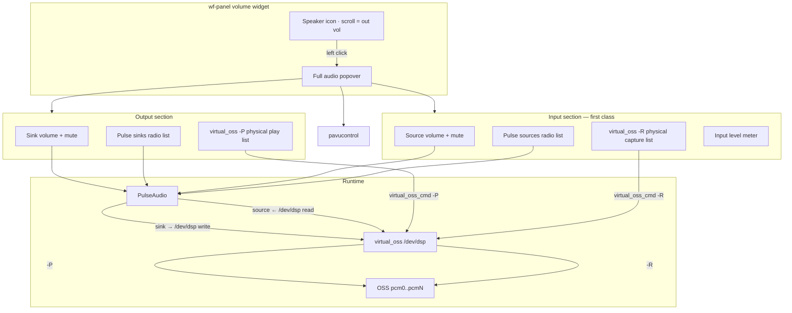
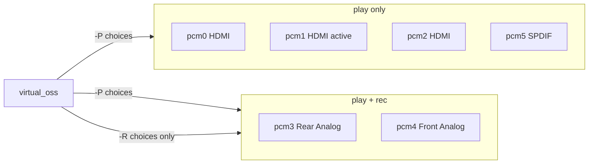
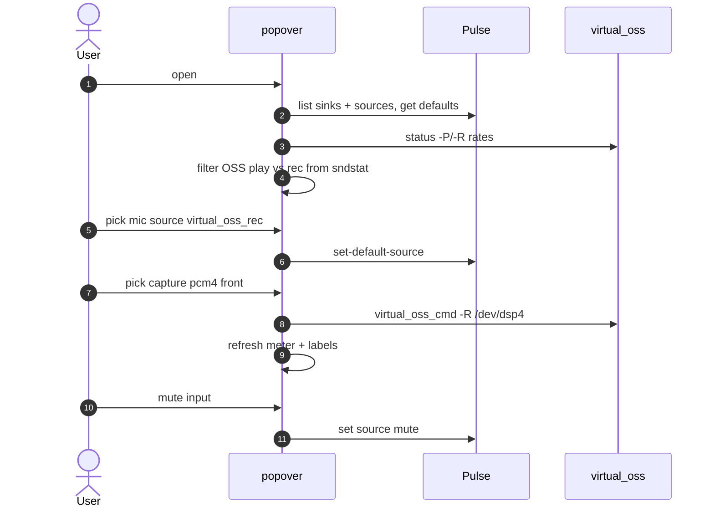
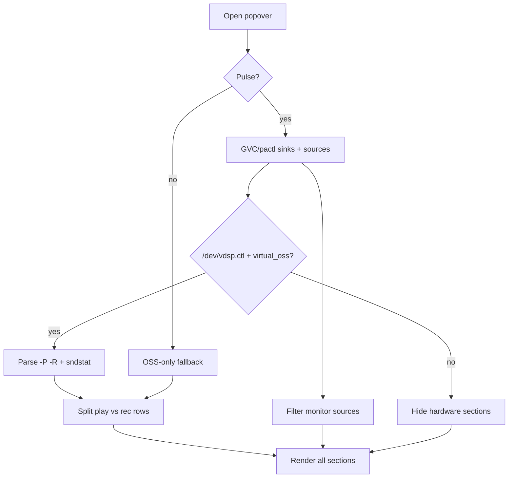

# Panel Audio Control — Plan (FreeBSD + virtual_oss)

**Repo:** `revytechinc/wf-shell` (`~/git/wf-shell`)  
**Status:** Planning / mockup review (backend platform layer done)  
**Runtime target:** **FreeBSD-centric** (15 + `virtual_oss` first-class when present)  
**Also:** Linux / Pulse-only hosts must work via modular autodetection — never crash if VOSS absent.

**Live host baseline (freedev007):**
- Play: `virtual_oss` → `-P /dev/dsp1` (NVIDIA HDMI pcm1)  
- Capture: `virtual_oss` → `-R /dev/dsp3` (Realtek rear play/rec)  
- Pulse default sink: `virtual_oss` · default source: `virtual_oss_rec`

---

## 0. Diagram conventions (from Honcho)

| Track | Use for | Form |
|-------|---------|------|
| **Mermaid** | Architecture, flows, state | Inline in this plan |
| **SVG + foreignObject** | Screen mockups | `diagrams/*.svg`, inline styles only |
| **HTML mockup** | Click-through | `mockup.html` (local inspect) |

---

## 1. Problem

Panel **volume** (`volume.cpp`) is GVC default-sink only:

- Scroll / mute only — **no input/mic path**  
- No Pulse sink/source pickers  
- No OSS / **virtual_oss** `-P` / `-R` management  

**mixer** (PipeWire) ≠ this host. **stream-chooser** = screencopy, not audio.

---

## 2. Goals — “all the things”

### Output (playback)
1. Volume + mute for **default sink** (scroll + middle-click preserved).  
2. **Pulse sinks** list → set default sink.  
3. **virtual_oss playback** (`-P`): pick physical OSS device among play-capable PCMs.  
4. Show active path: `Pulse sink → virtual_oss → pcmN`.

### Input (microphone / capture)
5. Volume + mute for **default source**.  
6. **Pulse sources** list → set default source (exclude monitors by default; toggle “show monitors”).  
7. **virtual_oss capture** (`-R`): pick record-capable OSS devices only (e.g. pcm3, pcm4 — not HDMI play-only).  
8. Optional **input level meter** (VU) while popover open.  
9. Quick **mute mic** without opening advanced tools.

### System
10. Detect virtual_oss; hide hardware sections if absent.  
11. Footer: Advanced → `pavucontrol` (tabs for apps).  
12. FreeBSD-first; degrade if Pulse-only or OSS-only.

---

## 3. Architecture







---

## 4. UI structure

### 4.1 Panel icon
| Action | Behavior |
|--------|----------|
| Scroll | Default **sink** volume |
| Shift+scroll (optional v2) | Default **source** volume |
| Middle / long-press | Mute **sink** |
| Left click | Open full popover |
| Tooltip | `Out 72% · pcm1  ·  In 40% · pcm3` |

Optional v2: dual glyph or small mic badge when input unmuted.

### 4.2 Popover layout (compact — dropdowns)

Device pickers are **dropdowns** (GTK `DropDown` / `ComboBoxText`), not tall radio lists.

```
┌──────────────────────────────────┐
│ Sound                   🔊 🎤    │
│ HDMI · this monitor · Rear mic   │
├──────────────────────────────────┤
│ OUTPUT                           │
│ [mute] ═══════════○ 72%          │
│ Output levels   [8 ch▾][wave-fill▾] │
│ ~~~~ wavy meter ~~~~             │
│ [ HDMI · this monitor         ▾] │  ← set_playback_device
│ Routes Virtual OSS play → dsp1   │
├──────────────────────────────────┤
│ INPUT                            │
│ [mute] ═══════════○ 40%          │
│ Input levels · stereo  [wave-fill▾] │
│ ~~~~ wavy meter ~~~~             │
│ [ Rear mic / line             ▾] │  ← set_capture_device
│ Routes Virtual OSS capture→dsp3  │
├──────────────────────────────────┤
│ VIRTUAL OSS            ● running │
│ Play     HDMI · this · /dev/dsp1 │
│ Capture  Rear mic    · /dev/dsp3 │
│ Format   48000 Hz · 16-bit · 2ch │
│ Control  /dev/vdsp.ctl           │
│ Mix ch [2▾] [Apply mix] [Refresh]│
├──────────────────────────────────┤
│ ● Virtual OSS       Advanced…    │
└──────────────────────────────────┘
```

No tutorial footnotes in the popover body. Details: **`man wf-shell-audio`**.

### Purpose (do not lose this)

The popover is a **Virtual OSS manager** with volume on top — not a pretty volume slider with a green badge.

| Action | Backend | Why it matters |
|--------|---------|----------------|
| Change Output dropdown | `set_playback_device(path)` | Switch HDMI / rear / SPDIF without CLI |
| Change Input dropdown | `set_capture_device(path)` | Switch mic jack without CLI |
| Virtual OSS strip | `virtual_oss_status()` | See running, paths, rate, bits, mix ch |
| Apply mix | reopen / reconfig `-C`/`-c` | Align open format with device capability |
| Refresh | re-query status | Confirm after external changes |
| Footer **Virtual OSS** | toggle strip | Always visible when detected (bottom-left) |
| Advanced… | pavucontrol | Per-app streams only |

When Virtual OSS is **not** running: hide the strip + badge; dropdowns fall back to software devices.

**Advanced…** for rare full-mixer cases.

### 4.3 Device eligibility rules

| PCM flags (`sndstat`) | In `-P` list | In `-R` list |
|----------------------|--------------|--------------|
| `(play)` only | yes | no |
| `(play/rec)` | yes | yes |
| `(rec)` only | no | yes |
| userspace `dsp` / `dsp.loop` | no (meta) | no |

---

## 5. Detection



---

## 6. Implementation sketch

### Done (platform layer)
| ID | Task | Status |
|----|------|--------|
| P0 | `IAudioBackend` + types + Factory/Builder | **done** |
| P1 | FreeBSD backend (sndstat, virtual_oss, pactl) | **done** |
| P2 | Linux backend (Pulse) | **done** |
| P3 | `wf-audio-info` CLI smoke tool | **done** — see `ARCHITECTURE.md` |

### UI (post-approval)
| ID | Task | Pri | Notes |
|----|------|-----|-------|
| A1 | Popover shell beyond single scale | P0 | volume.cpp uses `IAudioBackend` only |
| A2 | Output vol/mute + device **dropdown** | P0 | GVC + backend; VOSS play when present |
| A3 | Input vol/mute + device **dropdown** | P0 | capture-capable only under VOSS |
| A4 | Virtual OSS strip + badge (autodetect) | P0 | first-class when `features().virtual_oss` |
| A5 | Input level meter while open | P1 | |
| A6 | Show-monitors toggle | P2 | |
| A7 | Persist play/capture + mix prefs | P1 | wf-shell.ini |
| A8 | Shift+scroll = mic vol | P2 | |
| A9 | FreeBSD install from fork | P1 | |

### Documentation phase (required on every feature change)
Keep the **UI free of tutorial copy**. Deep detail goes to man pages and is updated in the same change set.

| ID | Task | When |
|----|------|------|
| D0 | Update `man/wf-shell-audio.7` | Any popover/backend/routing behavior change |
| D1 | Update `man/wf-audio-info.1` | CLI output or flags change |
| D2 | Update `docs/audio-control/ARCHITECTURE.md` | Factory/modules/features change |
| D3 | Update `docs/audio-control/PLAN.md` | Goals, layout, acceptance, open questions |
| D4 | Sync mockup/diagrams with UI only | No instructional footnotes in the popover |
| D5 | Optional: Honcho lesson when a green pattern lands | Architecture wins worth reusing |
| D6 | Update `docs/audio-control/SESSION-CONTROL.md` | Monitor/restart or UI-test harness changes |

**Definition of done for a slice:** code + tests green **and** man pages / ARCHITECTURE reflect the new behavior.

### Session control (byobu + Wayfire)

Agent runs in **byobu** (survives compositor death). UI tests need a live seat.

| Piece | Role |
|-------|------|
| `~/bin/wayfire-session` | `status` / `wait` / `monitor` / `stop` / `restart` / `ensure` |
| byobu pane | `WAYFIRE_MONITOR_AUTO_RESTART=1 wayfire-session monitor 3` |
| UI test prologue | `wayfire-session ensure` then export `WAYLAND_DISPLAY` from state file |

Details: [SESSION-CONTROL.md](SESSION-CONTROL.md).

**Out of scope v1:** per-app streams (pavucontrol), EQ, PipeWire mixer rewrite.

---

## 7. Graphical charts / mockups index

| File | Type | Purpose |
|------|------|---------|
| [diagrams/popover-closed.svg](diagrams/popover-closed.svg) | SVG UI | Panel idle (out % + mic % badge) |
| [diagrams/popover-open.svg](diagrams/popover-open.svg) | SVG UI | Full compact popover (dropdowns) |
| [diagrams/popover-hardware.svg](diagrams/popover-hardware.svg) | SVG UI | virtual_oss -P / -R hardware split |
| [diagrams/popover-input.svg](diagrams/popover-input.svg) | SVG UI | Mic section + stereo level meter |
| [diagrams/meters-out-in.svg](diagrams/meters-out-in.svg) | SVG chart | **Output multi-ch + input stereo meters** |
| [mockup.html](mockup.html) | HTML interactive | Click-through; **out 2/6/8-ch meter + mic stereo** |
| [ARCHITECTURE.md](ARCHITECTURE.md) | Mermaid | Factory/Builder class + flow diagrams |
| [PLAN.md](PLAN.md) (this file) | Mermaid | Architecture / sequence / state charts |

### Level meters (UI charts)

| Meter | Channels | Labels | Notes |
|-------|----------|--------|-------|
| **Output** | 2 / 6 / 8 (selectable in mockup) | L R · 5.1 · 7.1 (L R C LFE RL RR SL SR) | More bars than mic; matches HDMI |
| **Input** | 2 | L R | Same style as you liked on mic |

---

## 8. Acceptance

- [ ] Output + **input** both first-class (not collapsed-only)  
- [ ] Can switch mic hardware pcm3 ↔ pcm4 via `-R`  
- [ ] Can switch speaker HDMI pcm1 via `-P`  
- [ ] Pulse default sink/source selectable  
- [ ] Mute in/out independently  
- [ ] Level meter or clear “no signal” state  
- [ ] Scroll/mute-out behavior preserved  

---

## 9. Settings persistence

**Shell config is `~/.config/wf-shell.ini`**, not `wayfire.ini`.  
`wayfire.ini` is the compositor; panel/volume options are owned by **wf-shell** (`WfOption` → `[panel]`).

| Key | Default | Purpose |
|-----|---------|---------|
| `volume_graph_style` | **`wave-fill`** | Output meter graph type |
| `volume_graph_style_in` | **`wave-fill`** | Input meter graph type (independent) |
| `volume_out_channels` | `8` | Output meter channels 2/6/8 |
| `volume_show_monitor_sources` | `false` | Show Pulse `*.monitor` |
| `volume_play_device` | e.g. `/dev/dsp1` | Last play backend path |
| `volume_capture_device` | e.g. `/dev/dsp3` | Last capture backend path |
| `volume_mix_channels` | `2` | Preferred mix ch when Apply mix |
| `volume_prefer_virtual_oss` | `true` | Use VOSS when present |
| `volume_auto_switch_headset` | `true` | Jack plug → headset |
| `volume_auto_switch_usb` | `true` | USB attach → that device |
| `volume_auto_restore_previous` | `true` | Unplug → previous path |
| `volume_auto_switch_capture` | `true` | Also move mic with headset |
| `volume_notify_device_change` | `true` | Toast on auto-switch |
| `volume_manual_sticky` | `true` | Manual pick blocks auto until next plug |

Defined in `metadata/panel.xml` (WfOption / wcm / ini).  

**UI vs config:** The compact popover only exposes day-to-day controls (volume, devices, meters, Virtual OSS status). Behaviour switches live in **`~/.config/wf-shell.ini`** (and optionally wcm) — not as a wall of toggles in the popover.

## 10. Hotplug, headset auto-switch, restore previous

**Yes — product goal:** plug headset → switch; unplug → previous speakers; never crash.

| Case | Detection | Behavior |
|------|-----------|----------|
| **Headset plugged** | FreeBSD **devd** `SND/CONN` `OUT` `cdev=dspN` (HDA pin sense) | Push current play; `set_playback_device(headset)` |
| **Headset unplugged** | same | Pop stack → restore HDMI/speakers if still present |
| **USB DAC plug/unplug** | pcm appear/disappear | Same stack when `volume_auto_switch_usb` |
| Jack sense unsupported | no CONN events | Manual dropdown only |

This host: speakers/monitor ≈ **pcm1 HDMI**, front headset ≈ **pcm4** — different PCMs, so **we** move Virtual OSS play.

Manual Output pick = sticky until next plug event.

See ARCHITECTURE.md § Hotplug, headset plug, and auto-switch · `man wf-shell-audio`.

## 11. Open questions

1. Default panel: enhanced `volume` only on FreeBSD (drop PipeWire `mixer` from default layout)?  
2. On `-P` change, also set `hw.snd.default_unit`?  
3. Rewrite `virtual_oss_dsp` in rc.conf on device change, or only session-live via `virtual_oss_cmd`?  
4. Auto-fallback order when previous path also gone (HDMI → rear → first present)?  
5. devd-only vs also slow background poll while panel runs?

---

## 12. Detected features only (do not invent controls)

| Rule | Meaning |
|------|---------|
| **Only if it is there** | Surface mute/volume/ports/filters **only** when the device, mixer, or loaded module actually exposes them. |
| **No fake noise cancellation** | Do **not** add NS/AEC/AGC toggles unless we detect a real control (hardware mixer) **or** an already-loaded software path (e.g. Pulse `module-echo-cancel` source). |
| **USB simple mics** | Devices like Blue Snowball typically only have gain/mute — show that, nothing more. |
| **Optional software DSP** | Creating echo-cancel modules is out of scope for the compact UI unless later productized and still gated on capability detection. |

Probe → if absent, hide. Never gray out a pretend “Noise cancellation” that does nothing.

## 13. UI refresh discipline (do not forget)

| Rule | Why |
|------|-----|
| **Event-driven first** | Hardware plug/unplug (USB mic, cards) → GVC/Pulse/devd signals; poll only as a sparse fallback (e.g. FreeBSD `sndstat`). |
| **No refresh if unchanged** | Fingerprint device lists, active paths, status strings. If equal → **do not** `remove_all` / rebuild ComboBox / rewrite labels. |
| **Open menus are sacred** | Rebuilding a dropdown while the user has it open causes flicker and selection loss. |
| **Live routing > stale ini** | Virtual OSS `-P`/`-R` is truth for what’s selected; sync ini to match, not the reverse. |

This applies beyond audio: any panel widget that polls hardware or services should **diff before paint**.

## 13. Agent / collaboration rules (do not forget)

| Rule | Detail |
|------|--------|
| **No pull requests unless asked** | The project owner decides when (if ever) to open a PR. Agents must **not** create GitHub/GitLab PRs, `gh pr create`, or equivalent unsolicited. |
| **Branch + commit + push is fine** | Work on a feature branch; commit as **Mark LaPointe \<mark@cloudbsd.org\>**; push the branch when asked. Stop there. |
| **PR URL from remote is not a PR** | A remote may print “create a pull request by visiting…”. That is informational only — do **not** open it. |

### Final checks (end of testing / last pass)

Run this **after** code tests are green and before declaring work done:

- [ ] Unit / red-green suites green (`docs/audio-control/tests/run_all`, backend tests)
- [ ] Docs/man updated for behaviour changes (documentation phase)
- [ ] On a feature branch; working tree clean or intentional leftovers noted
- [ ] Author is **Mark LaPointe \<mark@cloudbsd.org\>** for project commits
- [ ] **Did not open a PR** (and will not, unless the user explicitly requests one this turn)
- [ ] Report branch name / commit SHA / push status only — owner decides next

If any step would create a PR automatically, **skip it**.
